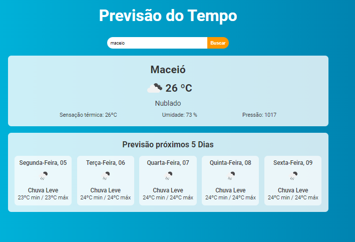

# Previsão do Tempo
Projeto em Reactjs, de previsão do tempo, consumindo duas APIs

## 🔥 Introdução
 O objetivo desse projeto é o usuario digitar a cidade ou o estado onde mora e ter a previsão do tempo de sua cidade em tempo real, diretamente de um servidor.
 

### ⚙️ Pré-requisitos
Não tem pré-requisitos, é só copiar o linke a baixo e colar no seu navegador, para testar o sistema.

### 🔗 Link
Clique no link abaixo para testar o projeto

[Site](https://melodic-cascaron-f9bfa9.netlify.app/)

### 🔨 Guia de instalação
 Não precisa instalar, o sistema roda Web (internet).

 ### 🛠️ Testes
 Teste unitario

 ### 👨‍💻 Tecnologias usadas
 - React;
 - JavaScript;
 - CSS3;
 - Axios; para o consumo das API;
 - Nodejs;

 **Frontend:**
 - staks do front
 > React, CSS3, JavaScript

 **Backend:**
 - Axios API, Weather

### 🙋 Autores / Colaboradores
* **Rodolfo Mori** - *autor do projeto* - [DevClub](https://www.youtube.com/@canaldevclub)
* **jailson dev** - *FrontEnd do projeto* - [jailsonn](https://github.com/jailsonn)

### 🔗 Licença
Esse projeto está sob a licença (N/A) - acesse os detatlhes [LICENSE.md](www.google.com).

### 🫂 Gratidão agradecimentos
- Obrigado por acompanha o meu projeto até aqui.
- Email de contato para: __jailson.nogueira2@gmail.com__
- WhatsApp: __159 8819-6147__
- LinkeDin: [meu_linkedin](https://www.linkedin.com/in/jailsonn-silva/)

